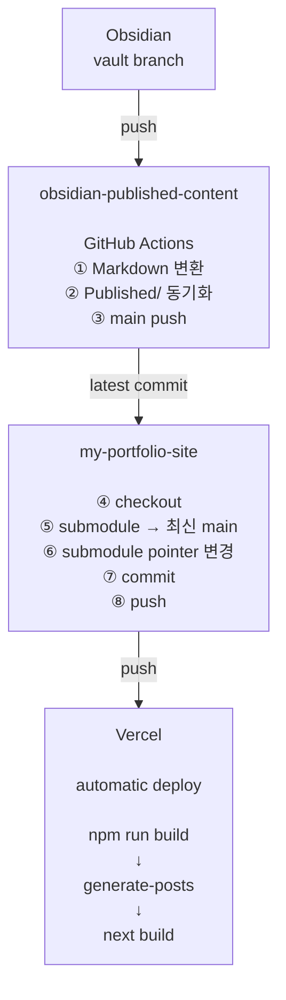

<br>

웹사이트 Version 2.0.0을 개발하기에 앞서, 여태까지 겉핥기 식으로만 알고있었던 UI/UX 지식을 좀 더 확실이 알아보고자 한다.  
실전 UI/UX 개발은 어떻게 이루어지는지, 성능 기본기를 포함하여 알아보도록 하자.  

<br>

# Web Performance & UI Optimization  

<br>

우선 UI/UX를 한 마디로 정의하면 다음과 같다.  
```  
UI = 어떻게 보이느냐
UX = 어떻게 느껴지느냐
```  

<br>

**UI(User Interface, 사용자 인터페이스)**  
| 사용자가 웹을 작동시키기 위해 접하는 화면 구성, 아이콘, 폰트, 버튼 등 시각적 요소와 매개체  

<br>

**UX(사용자 경험, User Experience)**  
| 사용자가 웹을 이용하면서 느끼는 총체적인 감정과 태도, 행동  

<br>

사실 더 범용적으로 정의할 수 있기는 한데 웹에 맞춰 정리해보았다.  

<br>

내가 좀 더 집중하며 개발할 것은 UX이기 때문에.. 그리고 사실 UI는 디자이너적 감각이 없는 이상 한계가 있다고 생각해서, Performance 위주로 파고들어보겠다.  

<br>

UX의 중요한 포인트는 다음과 같다.  
```  
성능 + 구조 + 흐름
```  

<br>

Google Lighthouse의 평가 지표를 예로 들어보자.  

<br>

**Google Lighthouse**  
| 구글에서 개발한 오픈소스 자동화 도구로, 웹사이트의 성능을 측정하고 개선 가이드를 제공한다.  

<br>

다음은 Lighthouse의 주요 5가지 평가 항목이다.  

<br>

| 항목                        | 의미                         |  
| ------------------------- | -------------------------- |  
| Performance (성능)          | 페이지 로딩 속도 및 렌더링 성능 측정      |  
| Accessibility (접근성)       | 장애인 사용자도 웹사이트를 이용하기 쉬운지 평가 |  
| Best Practices (모범 사례)    | 현대적인 웹 개발 표준 준수 여부 점검      |  
| SEO (검색엔진 최적화)            | 검색 결과 상위 노출에 최적화되었는지 평가    |  
| PWA (Progressive Web App) | 모바일 앱 같은 웹 환경 제공 여부 점검     |  

<br>

본격적으로 들어가기에 앞서 왜 이걸 공부해야하나 의구심이 들수도 있다. 사실 내 얘기다.  
그러나 이러한 총체적 성능을 개선하면 비즈니스 향상이나 사용자 경험 향상 등의 직관적 효과 말고도 굉장히 좋은 것을 달성할 수 있는데..  

<br>

이는 바로 **SEO(검색 엔진 최적화) 최적화다.**  

<br>

```  
Google은 Web Vitals 지표를 검색 순위 알고리즘에 반영하기 때문에 관련 지표를 개선하면 검색 결과에서 상위에 노출될 가능성이 높아진다.
```  

<br>

이를 Core Web Vital이라 정의한다.  

<br>

**Core Web Vital**  
| 구글이 웹사이트 사용자 경험을 객관적으로 평가하기 위해 정의한 지표이다.  
| 페이지 로딩 속도, 사용자 인터랙션, 시각적 안정성을 핵심 지표로 분류한다.  

<br>

**LCP, CLS, INP**  
| Core Web Vital을 구성하는 측정 항목. 시간이 지남에 따라 진화하므로 너무 자세히 알 필요는 없을듯  

<br>


<br>


 

  
- 최대 콘텐츠 페인트 (LCP): 로드성능을 측정한다. 우수한 사용자 환경을 제공하려면 페이지가 처음 로드되기 시작한 지 2.5초 이내에 LCP가 발생해야 한다. `왜 이렇게 늦게 뜸?`  
- 다음 페인트에 대한 상호작용 (INP): 상호작용을 측정한다. 우수한 사용자 환경을 제공하려면 페이지의 INP가 200밀리초 이하여야 한다. `왜 클릭했는데 안 움직임?`  
- 누적 레이아웃 변경 (CLS): 시각적 안정성을 측정한다. 우수한 사용자 환경을 제공하려면 페이지의 CLS가 0.1 이하를 유지해야 한다. `왜 화면이 흔들림?`  

<br>


<br>

| 지표                       | 설명                                                                                       |  
| ------------------------ | ---------------------------------------------------------------------------------------- |  
| LCP<br>(최대 콘텐츠 페인트)      | 로드성능을 측정한다. `왜 이렇게 늦게 뜸?`<br>우수한 사용자 환경을 제공하려면 페이지가 처음 로드되기 시작한 지 2.5s 이내에 LCP가 발생해야 한다. |  
| INP<br>(다음 페인트에 대한 상호작용) | 상호작용을 측정한다. `왜 클릭했는데 안 움직임?`<br>우수한 사용자 환경을 제공하려면 200ms 이하여야 한다.                         |  
| CLS<br>(누적 레이아웃 변경)      | 시각적 안정성을 측정한다. `왜 화면이 흔들림?`<br>우수한 사용자 환경을 제공하려면 0.1 이하를 유지해야 한다.                        |  

<br>


<br>

**FCP, TTFB, TBT, TTI, FID**  
| 위에 설명한 Vital의 문제 원인을 찾기 위한 엔지니어용 진단 지표이다. 문제가 발생한 이유를 설명한다.  

<br>


 
  

 
  

  

<br>

| 지표                                 | 의미                                                                               | 영향                    |  
| ---------------------------------- | -------------------------------------------------------------------------------- | --------------------- |  
| TTFB<br>(첫 번째 글까지 시간)              | 사용자가 HTTP 요청을 한 시점부터 브라우저가 서버로부터 첫 Byte 데이터를 수신할 때까지 걸리는 시간                      | LCP                   |  
| FCP<br>(첫 번째 컨티풀 페인트)              | 웹 페이지가 사용자 화면에 첫 콘텐츠를 표시하는 데 걸리는 시간                                              | 초기 렌더링 지연             |  
| TBT<br>(총 블로킹 시간)                  | 긴 작업으로 인해 메인 스레드가 차단되는 총 시간을 정량화하여 사용자 입력이 제때 처리되지 못할 때                          | INP↑<br>Interaction ↓ |  
| TTI<br>(Time to Interactive)       | 웹페이지가 완전히 인터랙티브하고 사용자 입력에 반응하는 데 걸리는 시간을 측정                                      | JS 로딩 과다              |  
| ~~FID~~<br>~~(First Input Delay)~~ | 웹 페이지가 대화형으로 전환되어 사용자의 첫 입력 이벤트(클릭, 탭, 키 누름)에 반응하는 데 걸리는 시간<br>2024 3월에 INP로 대체됨 | -                     |  

<br>

여기서 FID와 INP에 대해 헷갈릴 수도 있는데  
- FID는 첫 클릭만 측정한 지표고,  
- INP는 모든 인터렉션을 측정해서 평균 낸 지표다.  
그러니까 INP가 여러모로 범용적인 UX 지표인 셈이다.  

<br>

아래 사이트에 각각의 지표를 어떻게 최적화하는지 자세히 소개되어있다.  
[Other Web Vitals](https://crystallize.com/answers/tech-dev/other-web-vitals)  

<br>

그럼 이걸 왜 공부했냐?  
UI/UX를 개발할 때 다음과 같은 사고 흐름이 필요하기 때문이다. 예를 들어보자.  

<br>

1. 문제 발견 (Core Web Vitals)  
```  
LCP 느림
```  

<br>

2. 원인 분석 (진단 지표)  
```  
TTFB 느림 → 서버 문제
FCP 느림 → 렌더링 문제
```  

<br>

3. 해결  
```  
SSG 적용용
```  

<br>

**Lighthouse Component(v10)**  

<br>


  

<br>

현재 Google Lighthouse를 구성하는 요소다.  
버전에 따라 항목이 자주 변동된다.  
Web VItal 지표와 진단 지표가 적절히 섞여있는 양상을 보인다.  

<br>

# Vibe Coding  

<br>

이 프로젝트를 목표는 크게 두 개를 달성하려고 생각 중이다.  
바이브 코딩과 넓은 의미의 자동화다.  

<br>

| 도구      | 역할           |  
| ------- | ------------ |  
| ChatGPT | 설계 / 명세      |  
| Cursor  | 코드 생성 / 리팩토링 |  
| Copilot | 자동완성         |  
이런 식으로 써보려고 하는데, Copilot는 제쳐두더라도 Cursor는 꼭 써볼 요량이다.  

<br>

# Text Embedding  

<br>

현재 Markdown 파일을 다음과 같이 변환하여 포스팅하는 것을 계획 중이다.  

<br>

```  
Markdown -> Metadata Extract -> AI Tagging -> JSON Index Create
```  

<br>

# Concepts  

<br>

우선 UI/UX를 한 마디로 정의하면 다음과 같다.  
```  
UI = 어떻게 보이느냐
UX = 어떻게 느껴지느냐
```  

<br>

**UI(User Interface, 사용자 인터페이스)**  
| 사용자가 웹을 작동시키기 위해 접하는 화면 구성, 아이콘, 폰트, 버튼 등 시각적 요소와 매개체  

<br>

**UX(사용자 경험, User Experience)**  
| 사용자가 웹을 이용하면서 느끼는 총체적인 감정과 태도, 행동  

<br>

사실 더 범용적으로 정의할 수 있기는 한데 웹에 맞춰 정리해보았다.  

<br>

내가 좀 더 집중하며 개발할 것은 UX이기 때문에.. 그리고 사실 UI는 디자이너적 감각이 없는 이상 한계가 있다고 생각해서, Performance 위주로 파고들어보겠다.  

<br>

UX의 중요한 포인트는 다음과 같다.  
```  
성능 + 구조 + 흐름
```  

<br>

Google Lighthouse의 평가 지표를 예로 들어보자.  

<br>

**Google Lighthouse**  
| 구글에서 개발한 오픈소스 자동화 도구로, 웹사이트의 성능을 측정하고 개선 가이드를 제공한다.  

<br>

다음은 Lighthouse의 주요 5가지 평가 항목이다.  

<br>

| 항목                        | 의미                         |  
| ------------------------- | -------------------------- |  
| Performance (성능)          | 페이지 로딩 속도 및 렌더링 성능 측정      |  
| Accessibility (접근성)       | 장애인 사용자도 웹사이트를 이용하기 쉬운지 평가 |  
| Best Practices (모범 사례)    | 현대적인 웹 개발 표준 준수 여부 점검      |  
| SEO (검색엔진 최적화)            | 검색 결과 상위 노출에 최적화되었는지 평가    |  
| PWA (Progressive Web App) | 모바일 앱 같은 웹 환경 제공 여부 점검     |  

<br>

본격적으로 들어가기에 앞서 왜 이걸 공부해야하나 의구심이 들수도 있다. 사실 내 얘기다.  
그러나 이러한 총체적 성능을 개선하면 비즈니스 향상이나 사용자 경험 향상 등의 직관적 효과 말고도 굉장히 좋은 것을 달성할 수 있는데..  

<br>

이는 바로 **SEO(검색 엔진 최적화) 최적화다.**  

<br>

```  
Google은 Web Vitals 지표를 검색 순위 알고리즘에 반영하기 때문에 관련 지표를 개선하면 검색 결과에서 상위에 노출될 가능성이 높아진다.
```  

<br>

이를 Core Web Vital이라 정의한다.  

<br>

**Core Web Vital**  
| 구글이 웹사이트 사용자 경험을 객관적으로 평가하기 위해 정의한 지표이다.  
| 페이지 로딩 속도, 사용자 인터랙션, 시각적 안정성을 핵심 지표로 분류한다.  

<br>

**LCP, CLS, INP**  
| Core Web Vital을 구성하는 측정 항목. 시간이 지남에 따라 진화하므로 너무 자세히 알 필요는 없을듯  

<br>


<br>


 

  
- 최대 콘텐츠 페인트 (LCP): 로드성능을 측정한다. 우수한 사용자 환경을 제공하려면 페이지가 처음 로드되기 시작한 지 2.5초 이내에 LCP가 발생해야 한다. `왜 이렇게 늦게 뜸?`  
- 다음 페인트에 대한 상호작용 (INP): 상호작용을 측정한다. 우수한 사용자 환경을 제공하려면 페이지의 INP가 200밀리초 이하여야 한다. `왜 클릭했는데 안 움직임?`  
- 누적 레이아웃 변경 (CLS): 시각적 안정성을 측정한다. 우수한 사용자 환경을 제공하려면 페이지의 CLS가 0.1 이하를 유지해야 한다. `왜 화면이 흔들림?`  

<br>


<br>

| 지표                       | 설명                                                                                       |  
| ------------------------ | ---------------------------------------------------------------------------------------- |  
| LCP<br>(최대 콘텐츠 페인트)      | 로드성능을 측정한다. `왜 이렇게 늦게 뜸?`<br>우수한 사용자 환경을 제공하려면 페이지가 처음 로드되기 시작한 지 2.5s 이내에 LCP가 발생해야 한다. |  
| INP<br>(다음 페인트에 대한 상호작용) | 상호작용을 측정한다. `왜 클릭했는데 안 움직임?`<br>우수한 사용자 환경을 제공하려면 200ms 이하여야 한다.                         |  
| CLS<br>(누적 레이아웃 변경)      | 시각적 안정성을 측정한다. `왜 화면이 흔들림?`<br>우수한 사용자 환경을 제공하려면 0.1 이하를 유지해야 한다.                        |  

<br>


<br>

**FCP, TTFB, TBT, TTI, FID**  
| 위에 설명한 Vital의 문제 원인을 찾기 위한 엔지니어용 진단 지표이다. 문제가 발생한 이유를 설명한다.  

<br>


 
  

 
  

  

<br>

| 지표                                 | 의미                                                                               | 영향                    |  
| ---------------------------------- | -------------------------------------------------------------------------------- | --------------------- |  
| TTFB<br>(첫 번째 글까지 시간)              | 사용자가 HTTP 요청을 한 시점부터 브라우저가 서버로부터 첫 Byte 데이터를 수신할 때까지 걸리는 시간                      | LCP                   |  
| FCP<br>(첫 번째 컨티풀 페인트)              | 웹 페이지가 사용자 화면에 첫 콘텐츠를 표시하는 데 걸리는 시간                                              | 초기 렌더링 지연             |  
| TBT<br>(총 블로킹 시간)                  | 긴 작업으로 인해 메인 스레드가 차단되는 총 시간을 정량화하여 사용자 입력이 제때 처리되지 못할 때                          | INP↑<br>Interaction ↓ |  
| TTI<br>(Time to Interactive)       | 웹페이지가 완전히 인터랙티브하고 사용자 입력에 반응하는 데 걸리는 시간을 측정                                      | JS 로딩 과다              |  
| ~~FID~~<br>~~(First Input Delay)~~ | 웹 페이지가 대화형으로 전환되어 사용자의 첫 입력 이벤트(클릭, 탭, 키 누름)에 반응하는 데 걸리는 시간<br>2024 3월에 INP로 대체됨 | -                     |  

<br>

여기서 FID와 INP에 대해 헷갈릴 수도 있는데  
- FID는 첫 클릭만 측정한 지표고,  
- INP는 모든 인터렉션을 측정해서 평균 낸 지표다.  
그러니까 INP가 여러모로 범용적인 UX 지표인 셈이다.  

<br>

아래 사이트에 각각의 지표를 어떻게 최적화하는지 자세히 소개되어있다.  
[Other Web Vitals](https://crystallize.com/answers/tech-dev/other-web-vitals)  

<br>

그럼 이걸 왜 공부했냐?  
UI/UX를 개발할 때 다음과 같은 사고 흐름이 필요하기 때문이다. 예를 들어보자.  

<br>

1. 문제 발견 (Core Web Vitals)  
```  
LCP 느림
```  

<br>

2. 원인 분석 (진단 지표)  
```  
TTFB 느림 → 서버 문제
FCP 느림 → 렌더링 문제
```  

<br>

3. 해결  
```  
SSG 적용용
```  

<br>

**Lighthouse Component(v10)**  

<br>


  

<br>

현재 Google Lighthouse를 구성하는 요소다.  
버전에 따라 항목이 자주 변동된다.  
Web VItal 지표와 진단 지표가 적절히 섞여있는 양상을 보인다.  

<br>

**Context Engineering**  

<br>

[Context Engineering: AI 시대의 새로운 핵심 역량](https://devocean.sk.com/blog/techBoardDetail.do?id=167772)  

<br>

Context Engineering은 대형 언어 모델(LLM)의 성능을 극대화하기 위해 정보 환경을 체계적으로 설계하는 새로운 핵심역량으로, 단순히 프롬프트를 최적화하는 Prompt Engineering을 넘어선다.  
단순한 프롬프트 최적화를 넘어서 LLM의 전체 정보 환경을 체계적으로 설계하는 공식적인 학문 분야로 발전한 것이다.  

<br>

Context Engineering은 다음 세 가지 주요 영역으로 구성된다.  
1. Context Retrieval and Generation: 프롬프트 기반 생성, 외부 지식 습득, 동적 정보 검색  
2. Context Processing: 긴 시퀸스 처리, 자체 개선, 구조화된 정보 통합  
3. Context Management: 메모리 계층구조, 압축 최적화, 확장성 있는 관리  

<br>

Context Window: LLM이 한 번에 처리할 수 있는 토큰의 최대 길이  
```  
Context Window = System Prompt + Conversation History + Retrieved Documents + Current Input + Reserved for Output
```  

<br>

일정 관리 사례를 예시로 Prompt Engineering과 Context Engineering을 비교하자면 아래와 같다.  
- Prompt Engineering 접근: "내일 회의 일정 잡아줘" → 기본적이고 로봇적인 응답  
- Context Engineering 접근: 캘린더 정보, 과거 이메일, 연락처 정보, 도구 접근권한을 모두 통합 → "Jim! 내일은 하루종일 빽빽해. 목요일 오전이 괜찮다면? 초대장 보냈어, 확인해봐."  

<br>

# 2026.04.07 | Cursor Setting  

<br>

코테 준비 하다가 하기 싫어서 또 토이 프젝으로 도망 왔다.  
본격적인 사이트 개선에 앞서 바이브 코딩 준비를 해보고자 한다.  

<br>

오늘 달성하고자 하는 건 앞의 두 가지다. 나머지는 천천히 진행해보고자 한다.  
1. Cursor Setting  
2. `post.json` 및 `/posts` 페이지 생성  
3. `/posts/[slug]`  
4. TagFilter Component  
5. Supabase Connection  

<br>

우선 Cursor를 다운 받았다.  
Cursor는 따지자면.. 프로젝트 코드 전체 파일을 지속적으로 반영하여 개발을 보조하는,  
말하자면 GPT + VSCode 같은 느낌이다.  

<br>

Cursor에 프로젝트별 커스텀 프롬프트 세팅을 만들어보자.  
자세한 사항은 [규칙 | Cursor Docs](https://cursor.com/ko/help/customization/rules) 참조.  

<br>

내가 수립한 규칙은 다음과 같다.  
1. 기존 아키텍처 보호  
2. 내가 만든 Markdown Renderer만 쓰도록 하기  
3. RSC-first 강제: Server Component 우선 사용  
4. 과한 추상화 금지: 쓸데없는 util, wrapper 만들지 않기  
Cursor가 시니어 개발자처럼 행동하게 하는 것이 포인트다.  

<br>

이제 개발을 시작해보자.   

<br>


<br>

| Command     | Key        |  
| ----------- | ---------- |  
| 터미널 열기      | `Ctrl + J` |  
| Composer 모드 | `Ctrl + I` |  

<br>

# 2026.04.22 | Post Page & Tagging  

<br>

## Overview  

<br>

우선 포스팅 페이지를 구축했다.  
기존에 첫화면에서 사용해서 public에 두었던 `.md` 컨텐츠들은 따로 `content/*.md`로 옮겼고, 그에 따라 코드도 전폭 수정했다.  

<br>


  

  

<br>

1. Front Page에서 Archive Section을 없앴고,  
2. 상단에 Post 페이지 바로가기 버튼을 따로 만들었다.  
3. Post Page는 현재 `.md` 파일의 제목만을 읽어와 Renderer를 통해 렌더링 되는 링크 버튼이 나열되어있다.  

<br>

이 당시에 포스팅의 기반이 되는 Obsidian으로 작성한 Markdown에는 아직 Front Matter가 존재하지 않았다. 내가 옵시디언을 Raw하게 쓰고 있기도 했고 Template라는 것도 이번 개발을 진행하면서 처음알았다.  

<br>

## Development  

<br>

**Front Matter**  
| 마크다운 문서나 정적 사이트 파일의 최상단에 `---`로 구분된 영역에 작성하는 Metadata 블록이다.  

<br>

주로 YAML 형식을 사용하고 콘텐츠 본문 전의 설정 정보를 정의한다.  
주요 활용처는 다음과 같다:  
- 정적 사이트 생성기: Hugo, Hexo, Jekyll 등  
- 지식 관리 도구: Obsidian  
- AI 프롬프트: CLAUDE.md, SKILL.md 등 구조화된 문서 처리  

<br>

이런 식으로 작성한다.  
```yaml  
---
title: "포스트 제목"
date: 2024-04-20
tags: ["blog", "markdown"]
categories: ["Tech"]
---
```  

<br>

아까도 언급했지만 나는 옵시디언에 저런게 있는지조차 몰랐다`..`  
그래서 처음엔 생 마크다운 텍스트를 가지고 Front Matter를 생성하는 빌드 스크립트를 작성하고자 하였다.  

<br>

다음과 같은 개념들이 필요했다.  
- Markdown parsing  
- Static site indexing  
- NLP (embedding)  
- Information retrieval (cosine similarity)  
- Build pipeline  
- Caching system  

<br>

다음과 같은 파이프라인 구조를 띄고 있다.  
```text  
.md 파일들
   ↓
(front matter + 본문 분석)
   ↓
자동 태깅 + 요약 + slug 생성
   ↓
posts.json 생성
```  

<br>

gray-matter를 사용해서 markdown 문서를  
- Front Matter `data`와  
- 본문 `content`으로 나눈 뒤,  

<br>

태그 시스템을 기반으로 사이트 내 포스트 검색을 최적화하고자 하였다.  

<br>

#### Existing Tags  

<br>

Obsidian에서부터 날라온 태그들이다.  
그냥 둔다.  

<br>

#### Rule-based Tagging  

<br>

content의 내용을 분석해서 내가 정의한 keyword `tagRules` 기반으로 Rule-based Classification을 한다.  
그냥 이 과정은 본문 내용을 바탕으로 문자열 일치 여부만 채크해서 해당 keyword를 가지고 있는 tag를 태그로 추가하는, 하드 코딩이다. 내가 일일이 사전을 정립해야한다는 단점이 있다.  

<br>

#### Light AI Tagging - Embedding  

<br>

Embadding 기반 Taging을 하는데, `text-embadding-3-small`이라는 OpenAI API를 사용하였다.  
1. 글 제목 + 본문 일부를 Embedding을 통해 벡터로 변환한다.  
2. 미리 정의 해놓은, 블로그에서 사용할 태그 후보 집합 `TAG_VOCAB`도 벡터로 변환한다.  
3. `consineSimilarity()`를 이용해서 코사인 유사도를 계산한다. 1에 가까울 수록 의미적으로 비슷한거고, 0은 관계없음, -1는 반대이다.  
4. 1에 가까운 상위 3개의 태그를 선택한다.  

<br>

후에 Existing Tags + Rule-bsaed Tags + Light AI Tags를 모두 합쳐  
`tags`라는 Fonrt Matter 요소를 생성한다.  

<br>

음.. 굉장히 쓸데없는 짓을 했나 싶기도 하고  
경량 NLP 모델을 활용해서 의미있는 데이터를 추출했으니 좋은 경험이었나 싶기도 하다.  

<br>

## Result  

<br>


  
일단 굉장히 아마추어스러운 포스팅 화면이 완성되었다..  
요약도 그냥 마크다운 본문 앞에 몇글자 자른거라 `<br>`같은 것도 가감없이 표시되는 걸 볼 수 있다.  

<br>

하지만 현재 Obsidian을 이용해서 다음과 같이 AI Hybrid Tagging에 성공했기 때문에 금방 개선 가능할 것이다.  

  

<br>

Templater 기반 AI Hybrid Front Matter 생성에 대해선 후술하겠다.  

<br>

## Plan  

<br>

현재  
- Obsidian: 문서 작성 + Front Matter 생성  
- Site: Front Matter 생성(중복, 후에 중복되는 부분 삭제) + 포스트 페이지 + 마크다운 포스트 렌더링  

<br>

이니까 이 다음부터는  
메크로를 이용해서 내 포트폴리오 사이트 리포지토리의 content/posts/에 연동 시 Github Markdown으로 올라가도록 자동화해볼까 한다.  

<br>

그리고 그 다음엔 npm run generate-post가 실행되어 자동으로 post.json이 업데이트 되고, Post Page에 새로운 글이 생기는/또는 수정되는.. 과정을 진행해볼까 한다.  

<br>

이 과정에서는 draft 태그를 이용해 draft가 true(비공개)로 되어있으면 generate-post가 실행되지 않는 등 자원을 아끼는 방향으로 최대한 인프라를 구축해보고자 한다.  

<br>

# 2026.04.?? | Obsidian Templater - AI Hybrid Front Matter Generator  

<br>

우선 전체적으로 gemini-flash-mini 모델을 사용해서 TOC(Table of Context) + 앞의 1000자를 바탕으로 토픽과 관련된 태그를 추출해내는 것 까지는 구현해놓았다.  

<br>

# 2026.05.13 | Obsidian - Github - My-site 연동  

<br>

여태까지 구축해놓은 기능들을 활용 및 반영해서 Obsidian - My site 자동 연동 포스트 시스템을 새로이 구축하고자 한다.  

<br>

계획은 이렇다:  
```  
Obsidian Vault
    ↓
Published Content Repo
    ↓ (submodule)
Next.js Portfolio Site
    ↓
Vercel
```  

<br>

그러니까 아래와 같이 되는거다.  
- Obsidian = Authoring System  
- Github = Contents DB  
- Next.js = Renderer  

<br>

문제는 지금 콘텐츠랑 사이트 코드가 강하게 결합되어있다는 점인데..  

<br>

## Feat 1: Git hook `pre-push`  

<br>

일단 Git 이라는 Obsidian 플러그인을 깔았다.  

<br>

Obsidian Vault(파일탐색기)에서 git init을 하고, `.gitignore`를 다음과 같이 구성하였다.  
- 내가 올리기로 결정한 `Published` 폴더와 `Docs` 외에 모든 폴더 제외  
- `Docs` 폴더 안 민감 정보를 담고 있는 `.txt` 파일 제외  

<br>

일단 기본적인 Git 구성은 끝냈으니, 다음은 Git Hook를 이용하여 자동 변환 후 업로드를 해볼 차례다.  
```  
Git pre-push hook
    ↓
obsidian-to-github-md.py
    ↓
obsidian-published-content repo
```  

<br>

이때 주의해야할 사항은, 기존 `obsidian-to-github-md.py` 코드는 이미지 링크를 외부 URL 기반 변환이 아니라 그냥 Github 리포지토리 폴더 내에서 상대경로로 인식 가능하도록으로만 변환을 했다는 점이다.  
완전히 URL로 바꾸는 것은 사이트의 `MarkdownRenderer.tsx`에서 진행했었다.  
죽, 문법 변환이 github 올리기 전에 한 번, 사이트 렌더러에서 한 번 이루어지는 비효율적인 구조였다는 것이다.  

<br>

이 과정을 한꺼번에 합쳐서 다음과 같이 모듈별로 기능을 분리하고자 한다.  
- `obsidian-to-github-md.py`: 컴파일러  
- `MarkdownRenderer.tsx`: 렌더러  

<br>

GPT가 **jsDelivs CDN**이라는 것을 추천해줘서, 이걸로 한번 해볼까 한다.  
그낭 raw.githubusercontent.com보다는  
- 빠름  
- 안정적  
- Vercel 친화적  
이라고 한다.  

<br>

우선 이를 반영해서 사이트에 올릴 문서를 변환하는 `obsidian-to-github-md.py`의 수정을 완료하였고, github에서 무사히 렌더링 되는 것도 확인하였다.  

<br>

## Feat 2: Github Actions  

<br>

Git hook으로 자동 변환 워크플로우를 구축하면 `obsidian-to-github-md.py` 변환기 내부에서 subprocess로 git 커맨드를 돌리는 구조라 pre-push를 사용하면  
- 두 번 push가 된다거나,  
- commit 메시지를 내 맘대로 할 수 없다거나  
하는 문제가 있었다.  

<br>

그래서 Github Actions를 도입해서 `obsidian-to-github-md.py`는 변환기 역할만 수행하고 Git은 전혀 모르는 순수한 Compiler 역할만 담당하도록 변경했다.  
즉, `Published` 폴더의 원본 문서는 전혀 수정하지 않고 변환된 결과만 임시 폴더에 생성하도록 구조를 변경하였다.  

<br>

최종적으로 Github Actions를 활용하여 워크플로우를 다음과 같이 작성하였다.  
```  
git push
↓
GitHub Actions
↓
obsidian-to-github-md.py
↓
.temp_publish 생성
↓
Published 교체
↓
Commit
↓
Push
```  

<br>

즉, 로컬 Obsidian Vault는 항상 Obsidian 문법을 유지하고, GitHub 저장소에는 GitHub Markdown으로 변환된 문서만 저장되는 구조를 구축했다.  

<br>

또한 변환 과정은 GitHub Actions의 Runner 내부에서만 수행되기 때문에  
임시 폴더(`.temp_publish`)는 작업 종료와 함께 자동으로 삭제된다.  
따라서 저장소나 저장소에 불필요한 임시 파일이 커밋되지 않는다.  

<br>

현재까지는 GitHub Actions를 통해 변환된 Markdown 문서가 정상적으로 생성되고, 원격 저장소까지 자동으로 반영되는 것을 확인하였다.  

<br>

근데 이렇게 되면 로컬 커밋과 Github 커밋 플로우가 달라지기 때문에 `git push`로는 안 되고 `git push --force-with-lease`나  `git push --force`를 사용해야.. 하는데..  
Obsidian에서는 push를 커스텀 설정하는 기능이 없기 때문에 그냥 브랜치를 아예 분류하기로 했다.  

<br>

## Refactor: Separate Authoring and Deployment Branch  

<br>

```  
vault (Authoring)
├── Docs/
├── Published/      ← Obsidian Markdown
├── .github/
└── obsidian-to-github-md.py

        ↓ GitHub Actions

main (Deploy)
└── Published/      ← GitHub Markdown
```  

<br>

`vault` 브랜치는 Obsidian에서 직접 작성하는 원본 저장소 역할을 담당하고, `main` 브랜치는 GitHub에서 렌더링 가능한 Markdown만 보관하는 배포 브랜치로 사용하는 걸로 변경했다.  

<br>

GitHub Actions에서는 `vault` 브랜치에 Push가 발생하면 변환 스크립트를 실행하고, 생성된 결과만 `main` 브랜치의 `Published` 폴더에 반영하도록 구성하였다.  

<br>

결과적으로,  

<br>

- Obsidian에서는 기존 방식 그대로 문서를 작성하고,  
- GitHub에는 변환된 Markdown만 자동 게시되며,  
- Next.js는 `main` 브랜치의 `Published`만 읽도록 역할을 완전히 분리하였다.  

<br>

또한 이미지 링크도 `raw.githubusercontent.com` 기반으로 변환하여 GitHub에서도 별도 후처리 없이 Markdown 문서만으로 이미지가 정상적으로 표시되는 것을 확인하였다.  

<br>

# 2026.06.15 | Resume Page 개설 및 암호화  

<br>

다음과 같은 구조로 간단하게 만들어볼까 생각 중이다  

<br>

```  
Resume 클릭
↓
비밀번호 입력
↓
POST /api/auth
↓
성공
↓
HttpOnly Cookie 발급
↓
/resume 이동
↓
Download PDF
↓
/api/resume-pdf
↓
서버에서 PDF 생성
↓
다운로드
```  

<br>

# 2026.08.27 | Github Actions와 Submodule을 통한 자동화  

<br>



<br>

이 과정에서 my-portfolio-site 리포지토리 업데이트를 obsidian-public-content의 Github Actions로 트리거 해야하는데, 이때 **Github PAT**가 필요하다.  
이는 Github에서 비밀번호 대신 사용하는 인증용 토큰이다  

<br>

PAT는 다음과 같은 종류가 있다.  
- Fine-grained: 권한 세분화, 특정 리포지토리에만 적용할 거면 이게 좋다.  
- Classic: 구버전. 좀 더 범용적인 사용에 쓴다.  

<br>

내 계정 `Setting > Developer Settings > Personal access tokens > Fine-grained tokens`에 들어가서 my-portfolio-site 만을 선택한 뒤 `Content: Read & Write` 권한만 부여해주면 된다.  
만료 기간은 귀찮으니 기한 없음으로 뒀다.  

<br>

그리고 발급된 키를 `obsidian-published-content > Settings > Secrets and variables > Actions > Repository secrets`에 추가하면 된다.  

<br>


<br>
